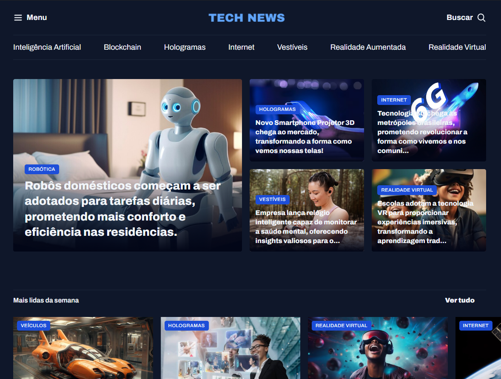

# 📰 Tech News — Portal de Notícias
 
Projeto desenvolvido durante o curso de **HTML e CSS da Rocketseat**, como prática de construção de layout, estruturação semântica e estilização de uma página web responsiva no modelo de portal de notícias de tecnologia.
 

 
> 💡 Substitua a imagem acima por um print real do projeto salvo em `assets/images/preview.png`.
 
## 🚀 Sobre o projeto
 
O **Tech News** é um portal de notícias fictício focado em tecnologia, com destaque para categorias como Inteligência Artificial, Blockchain, Hologramas, Internet, Vestíveis, Realidade Aumentada e Realidade Virtual.
 
A página conta com:
 
- Header fixo com menu de navegação e categorias
- Seção de destaque com matéria principal e notícias secundárias
- Seção "Mais lidas da semana" com cards de notícias
- Tags coloridas por categoria (Robótica, Hologramas, Internet, Vestíveis, Realidade Virtual, etc.)
- Layout construído com HTML semântico e CSS puro (sem frameworks)
## 🛠️ Tecnologias utilizadas
 
- **HTML5** — estruturação semântica do conteúdo
- **CSS3** — estilização, layout e responsividade
- Sem uso de bibliotecas ou frameworks externos
## 📁 Estrutura do projeto
 
```
Portal de Notícias/
├── assets/
│   ├── icons/       # Ícones utilizados no layout
│   └── images/      # Imagens das notícias
├── styles/
│   ├── global.css   # Reset e estilos globais
│   ├── header.css   # Estilos do cabeçalho e menu
│   ├── index.css    # Estilos específicos da página inicial
│   ├── section.css  # Estilos das seções de notícias
│   └── utility.css  # Classes utilitárias
└── index.html        # Página principal
```
 
## ▶️ Como executar o projeto
 
Este é um projeto **estático** (HTML + CSS), sem dependências de Node.js ou npm. Para rodar localmente, escolha uma das opções abaixo:
 
### Opção 1 — Abrir direto no navegador
 
Basta abrir o arquivo `index.html` no navegador de sua preferência.
 
### Opção 2 — Live Server (recomendado)
 
1. Abra a pasta do projeto no VS Code
2. Instale a extensão **Live Server** (autor: Ritwick Dey)
3. Clique com o botão direito em `index.html` → **Open with Live Server**
   - ou clique em **Go Live** no canto inferior direito da tela
O projeto abrirá em `http://127.0.0.1:5500` (ou porta similar) com atualização automática a cada alteração salva.
 
## 🎯 Objetivo de aprendizado
 
Este projeto foi construído com o objetivo de praticar:
 
- Estruturação de HTML semântico
- Organização de estilos CSS em múltiplos arquivos
- Criação de layouts em grid/flexbox
- Boas práticas de nomenclatura de classes
- Responsividade básica de página
## 👤 Autor
 
Desenvolvido por **Rodrigo Baião** durante a formação Full-Stack da Rocketseat.
 
- GitHub: [github.com/rodrigobaiaodev](https://github.com/rodrigobaiaodev)
- LinkedIn: [linkedin.com/in/rodrigo-baiao](https://linkedin.com/in/rodrigo-baiao)
 